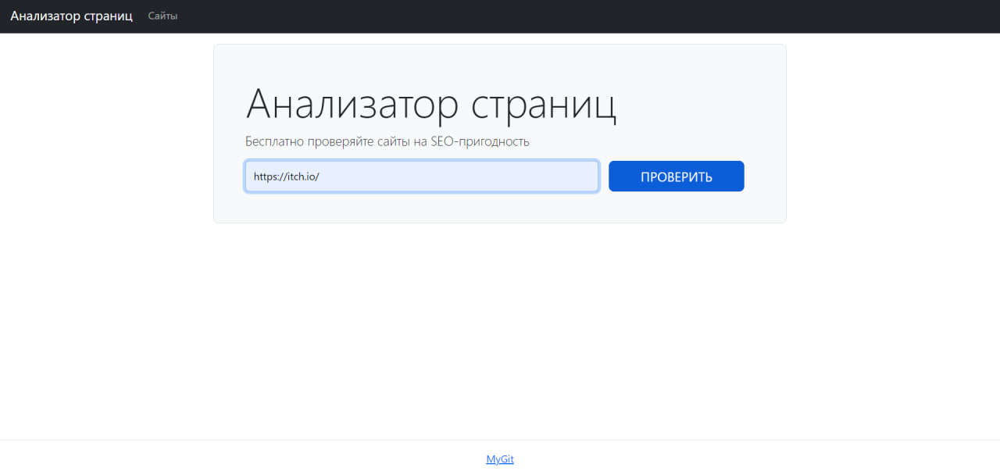
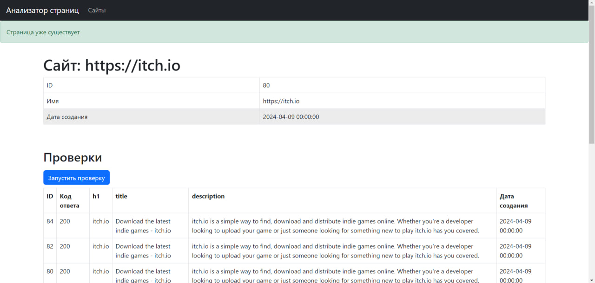
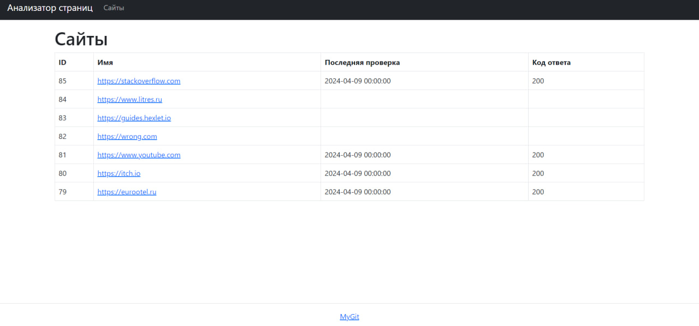

### Hexlet tests and linter status:

## О приложении
Page Analyzer – это сайт, который анализирует указанные страницы на SEO-пригодность по аналогии с PageSpeed Insights:

### Live Domen
[Live domen](https://python-project-83-swmd.onrender.com)